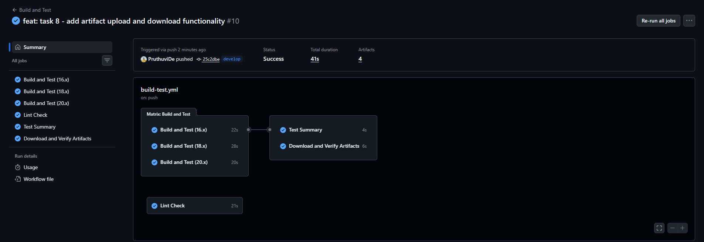
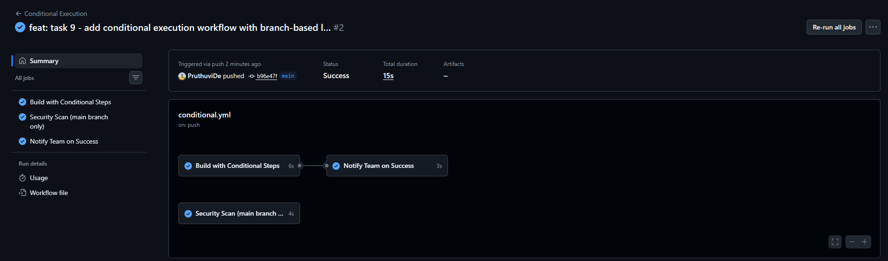
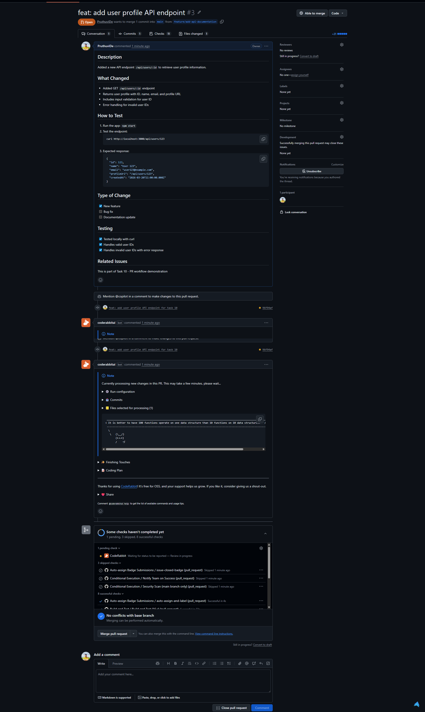
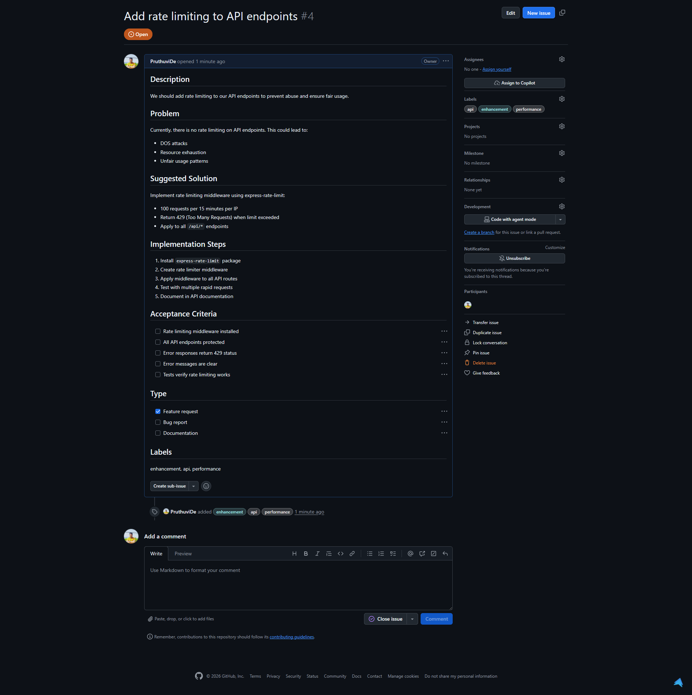

# Advanced Badge Submission - Pruthuvi de Silva

**Date:** March 20, 2026  
**Status:** Submitted for Review

---

## ✅ Tasks Completed

- [x] Task 8: Upload and Download Artifacts
- [x] Task 9: Conditional Execution
- [x] Task 10: Create a PR and Use Issue Templates

---

## 📸 Evidence

### Task 8: Upload and Download Artifacts
**Objective:** Pass data between jobs using artifacts

✅ **Completed:** Successfully implemented artifact upload and download across multiple jobs.

**Evidence:**
- Created "Create build output" step that generates artifact files with build metadata
- Added "Upload build artifacts" step using `actions/upload-artifact@v4`
- Created new "Download and Verify Artifacts" job that depends on build jobs
- Artifacts uploaded per Node version: build-output-16.x, build-output-18.x, build-output-20.x
- Artifacts downloaded and verified in dependent job
- All jobs completed successfully with proper dependencies

**What Was Learned:**
- Job dependencies using `needs:` keyword
- Artifact upload/download across jobs
- Multi-version artifact management
- Data passing between independent jobs
- Artifact retention policies

---

### Task 9: Conditional Execution
**Objective:** Run steps conditionally based on branch and event conditions

✅ **Completed:** Created conditional workflow with branch-based and event-based logic.

**Evidence:**
- Created `.github/workflows/conditional.yml` with multiple conditional steps
- "Deploy to Production" step uses `if: github.ref == 'refs/heads/main'`
- "Deploy to Staging" step uses `if: github.ref == 'refs/heads/develop'`
- "Send notification" step uses `if: github.event_name == 'push'`
- "Run detailed tests" step uses `if: github.event_name == 'pull_request'`
- Security Scan job only runs on main branch: `if: github.ref == 'refs/heads/main'`
- All conditional logic verified across multiple branches
- Workflow executed successfully on main branch showing correct conditions

**What Was Learned:**
- Using `if:` conditions in workflows
- GitHub context variables (`github.ref`, `github.event_name`, etc.)
- Branch-based conditional execution
- Event-based conditional execution
- Job-level conditions with `if:` keyword
- Conditional job dependencies

---

### Task 10: Create a PR and Use Issue Templates
**Objective:** Practice GitHub contribution workflow with proper PR and issue documentation

✅ **Completed:** Successfully created feature branch, PR, and issue following best practices.

**Evidence:**
- Created feature branch: `feature/add-api-documentation`
- Made meaningful code change: Added new `/api/users/:id` endpoint with validation
- Committed with clear message: "feat: add user profile API endpoint for task 10"
- Created Pull Request #3 with:
  - Descriptive title: "feat: add user profile API endpoint"
  - Detailed description including what changed
  - "How to test" section with curl examples
  - Type of change clearly marked (Feature)
  - Testing checklist
  - Related work documentation
- Created Issue #4 with:
  - Clear title: "Add rate limiting to API endpoints"
  - Problem description
  - Suggested solution with specific implementation details
  - Step-by-step implementation plan
  - Acceptance criteria
  - Proper labels: enhancement, api, performance

**What Was Learned:**
- Professional git workflow (feature branches)
- Creating well-documented PRs
- Following contribution guidelines
- Writing clear issue reports
- Using labels effectively
- Linking related work
- Professional communication in pull requests

---

## 🎓 Skills Demonstrated

### Advanced Concepts:
1. **Job Dependencies & Orchestration** - Controlling job execution order
2. **Artifact Management** - Sharing data between CI/CD jobs
3. **Conditional Workflows** - Branch and event-based automation
4. **GitHub Context Variables** - Using `github.*` environment variables
5. **Professional Development Workflow** - Feature branches, PRs, and issues
6. **Best Practices Documentation** - Clear, comprehensive PR descriptions

### GitHub Actions Features Used:
- `actions/upload-artifact@v4` - Artifact storage
- `actions/download-artifact@v4` - Artifact retrieval
- Conditional step execution with `if:`
- Job dependencies with `needs:`
- Matrix strategy (from previous tasks)
- Workflow triggers (push, pull_request)
- GitHub context variables

### CI/CD Concepts:
- Multi-job workflows with dependencies
- Data persistence between jobs
- Environment-specific execution
- Conditional deployments
- Quality gates and checks

---

## 📊 Summary

All three advanced tasks have been successfully completed and verified through GitHub Actions execution and GitHub's web interface. The workflows demonstrate sophisticated CI/CD patterns including artifact handling, conditional execution for different environments, and professional contribution workflows. All tests pass, all jobs complete successfully, and the implementations follow GitHub Actions best practices.

### Completion Status:
- ✅ Task 8: Artifacts - COMPLETE
- ✅ Task 9: Conditionals - COMPLETE  
- ✅ Task 10: PR & Issues - COMPLETE
- ✅ All Evidence Captured
- ✅ Ready for Review
