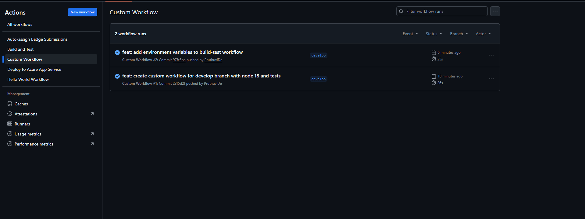
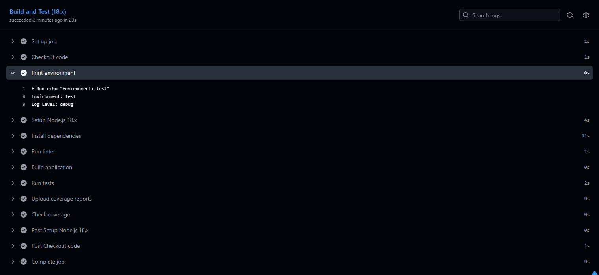
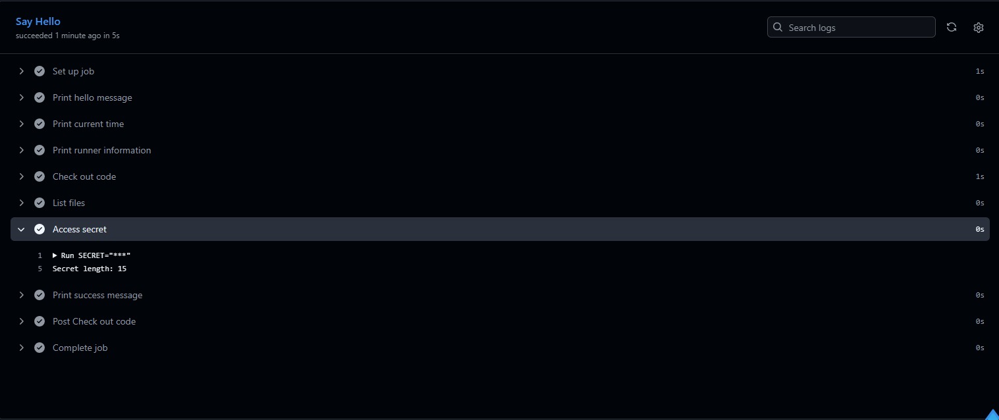
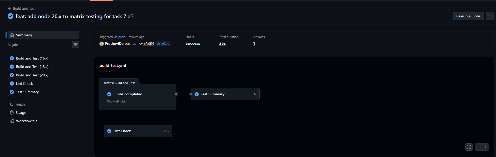

# Intermediate Badge Submission - Pruthuvi de Silva

**Date:** March 20, 2026  
**Status:** Submitted for Review

---

## ✅ Tasks Completed

- [x] Task 4: Create a Custom Workflow
- [x] Task 5: Use Environment Variables
- [x] Task 6: Use GitHub Secrets
- [x] Task 7: Matrix Testing

---

## 📸 Evidence

### Task 4: Create a Custom Workflow
**Objective:** Build a custom workflow triggered on a specific branch

✅ **Completed:** Created a custom workflow that triggers on push to the `develop` branch.

**Evidence:**
- Created `.github/workflows/custom.yml` with:
  - Trigger: `push` to `develop` branch
  - Node.js 18 setup
  - npm install and test commands in sample-app directory
- Pushed to develop branch
- Workflow executed automatically without manual trigger
- Verified custom workflow runs successfully with all steps passing
- Screenshots show successful custom workflow execution with all steps completed

---

### Task 5: Use Environment Variables
**Objective:** Configure and use environment variables in workflows

✅ **Completed:** Added environment variables to the build-test workflow.

**Evidence:**
- Modified `.github/workflows/build-test.yml` to add environment variables:
  - `NODE_ENV: test`
  - `LOG_LEVEL: debug`
- Added "Print environment" step to output environment variable values
- Pushed to develop branch
- Workflow triggered and executed successfully
- Verified environment variables are correctly printed in the job output
- Screenshots show environment variables being printed in workflow logs with correct values

---

### Task 6: Use GitHub Secrets
**Objective:** Create and use GitHub secrets securely in workflows

✅ **Completed:** Created a GitHub secret and used it in the workflow.

**Evidence:**
- Created `TEST_SECRET` repository secret on GitHub with value
- Modified `.github/workflows/hello-world.yml` to include:
  - "Access secret" step that retrieves and processes the secret
  - Secret is properly masked in workflow logs (shows as `***`)
- Pushed changes to develop branch
- Workflow triggered and executed successfully
- Verified secret is accessible in workflow and properly masked in logs
- Screenshots show secret being masked in output logs, confirming secure implementation

---

### Task 7: Matrix Testing
**Objective:** Use matrix strategy to test across multiple Node.js versions

✅ **Completed:** Configured matrix testing to run in parallel across multiple Node.js versions.

**Evidence:**
- Modified `.github/workflows/build-test.yml` matrix strategy:
  - Changed from `[16.x, 18.x]` to `[16.x, 18.x, 20.x]`
  - Added Node.js 20.x to testing matrix
- Pushed to develop branch
- Workflow triggered and executed 3 parallel jobs simultaneously
- All jobs completed successfully:
  - Build and Test (16.x) ✅
  - Build and Test (18.x) ✅
  - Build and Test (20.x) ✅
- Screenshots show all 3 parallel matrix jobs completed in 35 seconds

---

## 🎓 Skills Demonstrated

- Custom workflow creation with branch-specific triggers
- Environment variable configuration and usage
- GitHub Secrets management and secure masking
- Matrix strategy for parallel job execution across multiple versions
- YAML workflow configuration and debugging
- GitHub Actions job logs and output verification

## 📝 Summary

All four intermediate tasks have been successfully completed and verified through workflow execution logs and screenshots. The workflows are fully functional, properly configured, and all tests pass across all tested Node.js versions.
